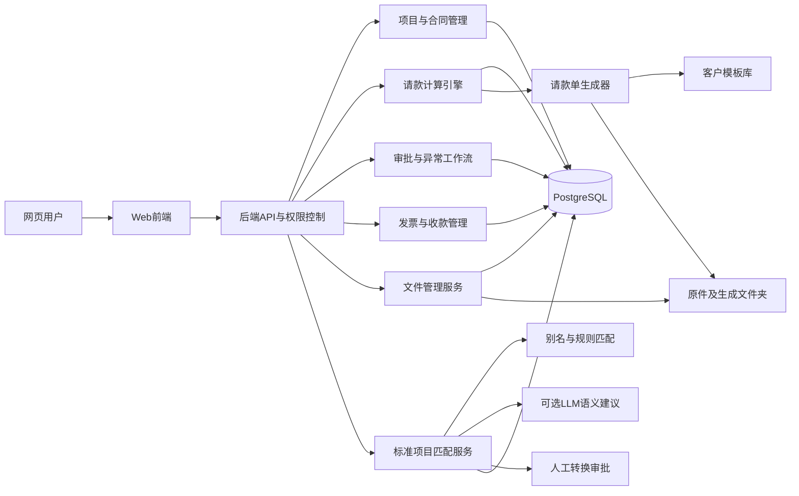

# 系统架构 (Architecture)

## 概述

Maggie 采用前后端分离 + 异步任务的架构，全部容器化运行于 Docker Compose。前端为 Next.js 静态导出 SPA，后端为 FastAPI REST API，数据持久化于 PostgreSQL 16（含 pgvector），异步任务由 Celery + Redis 驱动。

---

## 架构图



## 请求流向

```
Browser ── HTTPS ──> nginx (frontend static + /api proxy)
                         │
                         ├── Next.js static export
                         └── FastAPI (api) ──> PostgreSQL (data + pgvector)
                                  │          └── Redis (broker + cache)
                                  └── Celery worker ──> Playwright (PDF)
                                                       └── LLM client (OpenAI-compat or Stub)
                                  └── File service ──> /data/archive (volume)
```

---

## Docker Compose 服务 (5 个)

| 服务 | 镜像 | 角色 | 端口 |
|---|---|---|---|
| `frontend` | node:20-alpine (构建) → Next.js standalone | SPA + 反向代理 `/api` → `api` | 3000 |
| `api` | python:3.12-slim + FastAPI | REST API、认证、RBAC、业务逻辑 | 8000 |
| `worker` | 同 `api` 镜像 + Celery | 异步任务：PDF 生成、哈希、LLM 匹配 | — |
| `postgres` | pgvector/pgvector:pg16 | 业务数据 + 可选向量检索 | 5432 |
| `redis` | redis:7-alpine | Celery broker + result backend | 6379 |

**镜像共享**：`api` 和 `worker` 共享同一个 Docker 镜像（构建一次，两个 entrypoint）。`api` 运行 `uvicorn`，`worker` 运行 `celery`。

### 服务依赖关系

- `api` 依赖 `postgres`（健康检查通过）和 `redis`（健康检查通过）。
- `worker` 依赖 `postgres` 和 `redis`。
- `frontend` 依赖 `api`。
- `postgres` 和 `redis` 无外部依赖。

### 数据卷

| 卷 | 用途 |
|---|---|
| `pgdata` | PostgreSQL 数据目录 |
| `archive` | 文件存储（合同原件、生成文档） |

---

## 计算引擎设计 (Calculation Engine)

计算引擎位于 `backend/app/services/calc_engine.py`，遵循**纯函数**设计原则：

### 纯函数特性

- **无数据库依赖**：引擎不导入任何 ORM 模型，操作对象为 dataclass 输入。
- **无副作用**：相同输入永远产生相同输出，不修改任何外部状态。
- **确定性**：使用 `decimal.Decimal` 显式上下文，避免浮点误差。
- **可独立测试**：单元测试无需数据库 fixture。

### 公共 API

```python
calc_line_current(item, prev_approved_qty, current_claimed_qty, price_snapshot,
                  rule_set, rounding_policy) -> LineResult

calc_application(lines, deductions, retention_entries_prev, tax_mode, tax_rate,
                 rounding_policy) -> ApplicationTotals

validate_application(application, contract_version, prior_posted, rules) -> ValidationReport
```

### 计算不变量

1. **数量制** (QUANTITY)：`金额 = 批准数量 × 单价快照`。用户编辑数量，不编辑金额。
2. **总价制** (LUMP_SUM)：接受比例或直接金额；直接金额需附原因；超阈值需审批。
3. **里程碑制** (MILESTONE)：关联 `milestone_event.status=APPROVED` 时释放全额或配置比例。
4. **可用量** = `合同数量 + 批准变更增量 − 批准扣减量`。剩余 = 可用量 − 累计已批准。超量抛 `OverclaimError`，**绝不静默截断**。
5. **保留款** = `基数 × 比例`，基数由 `payment_rules.calculation_base` 定义。
6. **保留款释放**通过台账分录（RELEASE/REVERSAL），不读取可变余额列。
7. **税额**由 `tax_mode` (EXCLUSIVE/INCLUSIVE/MIXED) 决定计算基数，舍入策略按合同配置。
8. **净额** = `本期完成 − 保留款 + 释放保留款 − 扣款 + 税`，符号显式。
9. **过账幂等**：`post(app_id, action_id)` — 若 `(app_id, action_id)` 已在台账，返回上次结果不重复写入。
10. **过账冻结**：POSTED 后编辑返回 409；更正需创建冲销 + 新修订（`supersedes_application_id`）。

---

## 文件服务设计 (File Service)

文件服务位于 `backend/app/services/file_service.py`，核心安全设计：

### 路径安全 (Path Traversal Prevention)

```python
def _resolve_safe_path(storage_root: StorageRoot, relative_path: str) -> Path:
    base = Path(storage_root.base_path).resolve()
    target = (base / relative_path).resolve()
    try:
        target.relative_to(base)  # 确保目标在根目录内
    except ValueError:
        raise PathTraversalException(f"Path '{relative_path}' escapes storage root")
    return target
```

- 上传时对 `relative_path` 执行 `resolve()` 规范化。
- 断言解析后路径必须 `is_relative_to(storage_root)`，否则抛 `PathTraversalException`。
- **用户永不输入绝对路径**——DB 仅存 `storage_root_id + relative_path`。

### 文件不可变性

- 原始文件 `is_immutable=true`, `is_original=true`，**永不覆盖**。
- 哈希冲突时存储为 `<uuid>.<ext>`，不合并业务链接。
- 下载通过 `document_id` 流式返回，设置 `Content-Disposition: attachment; filename="<original_name>"`（RFC 5987），**绝不返回服务器绝对路径**。
- 逻辑删除设置 `deleted_at`；物理删除为独立管理工具。

### 哈希校验

- 上传前计算 SHA-256（流式 8KB 分块读取）。
- 重复哈希标记但**不合并**业务链接。
- 确保文件完整性可验证。

### 目录结构

```
{FILE_STORAGE_ROOT}/
  {organization_code}/
    {internal_project_code}/
      contracts/{external_contract_no}/v001/{original,extracted}/
      applications/{application_no}/{attachments,generated}/
      variations/ deductions/ milestones/ invoices/ collections/
      correspondence/ reports/
```

---

## 审批工作流模型 (Approval Workflow)

审批工作流定义可配置的多级审批模板：

### 数据模型

| 表 | 说明 |
|---|---|
| `approval_workflows` | 审批模板（如"请款 > 1,000,000 → 项目负责人 + 造价 + 财务"） |
| `approval_steps` | 有序的角色门控步骤列表 |
| `approvals` | 每位审批人的决策记录 |

### 审批规则

- 资源（合同版本、项目映射、变更单、请款单、扣款、保留款释放）**仅在所有必需步骤 APPROVED 后**才视为已批准。
- **幂等**：重复审批返回已存在的记录。
- **拒绝**创建 `REJECTED` 记录并冻结资源；用户必须创建新修订（**不可解冻被拒绝的资源**）。
- 工作流可按金额、项目、合同或异常类型配置。

### 请款审批流程

```
DRAFT → SUBMITTED → PROJECT_APPROVED → FINANCE_APPROVED → POSTED
```

1. 用户提交请款（SUBMITTED）。
2. 项目负责人审核（PROJECT_APPROVED）——需 `PROJECT_MANAGER` 角色。
3. 财务复核（FINANCE_APPROVED）——需 `FINANCE_REVIEWER` 角色。
4. 过账（POSTED）——幂等操作，冻结所有行，生成台账分录。

---

## 前端架构

- **框架**：Next.js 14 App Router，`output: 'standalone'` 模式。
- **路由**：`/`（登录）、`/dashboard`（驾驶舱）、`/projects/[id]`（项目详情，标签页）、`/applications/new`（请款向导）。
- **API 代理**：`next.config.mjs` 中 `rewrites` 将 `/api/*` 转发至 `http://api:8000/*`。
- **认证**：cookie-based，`credentials: 'include'` 自动携带。
- **原则**：前端不做任何业务计算，所有计算结果来自 API。

---

## 异步任务 (Celery Worker)

| 任务 | 触发 | 说明 |
|---|---|---|
| PDF 生成 | 请款过账后 | Playwright Chromium 渲染 A4 PDF |
| Excel 生成 | 请款过账后 | openpyxl 生成 .xlsx |
| 文件哈希 | 上传后 | SHA-256 计算（大文件异步） |
| LLM 匹配 | 手动触发（Phase 2+） | 标准项目语义匹配建议 |

Worker 与 API 共享镜像，确保业务逻辑代码一致。
