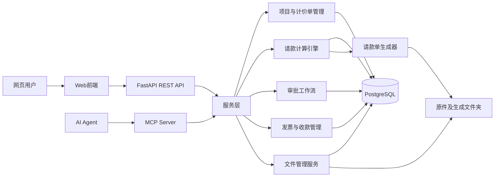

# 系统架构 (Architecture)

## 概述

Maggie 采用前后端分离 + 异步任务的架构，全部容器化运行于 Docker Compose。前端为 Next.js App Router，后端为 FastAPI REST API + MCP Server（供 AI Agent），数据持久化于 PostgreSQL 16，异步任务由 Celery + Redis 驱动。系统为单一本地用户，无认证/权限。

---

## 架构图



## 请求流向

```
Browser ── HTTP ──> Next.js dev server (/api proxy)
                         │
                         └── FastAPI (api) ──> PostgreSQL
                                  │          └── Redis (broker + cache)
                                  └── Celery worker ──> Playwright (PDF) / OCR
                                  └── File service ──> /data/archive (volume)

AI Agent ── MCP (stdio/SSE) ──> MCP Server ──> Service Layer ──> PostgreSQL
```

### 本地开发访问

Docker Compose 开发环境将前端与 API 分别公开到主机端口：

| 地址 | 用途 |
|---|---|
| `http://localhost:3000` | Maggie 网页系统的登录与业务页面；应作为日常使用入口。 |
| `http://localhost:8000` | FastAPI 后端 API，不提供业务网页。 |
| `http://localhost:8000/api/docs` | FastAPI Swagger API 文档。 |
| `http://localhost:8000/health` | 仅健康检查，返回 JSON 状态而非 HTML 页面。 |

浏览器对 `/api/*` 的请求由 Next.js 开发服务器代理至 `api:8000`；前端使用 cookie 凭证访问 API。

---

## Docker Compose 服务 (5 个)

| 服务 | 镜像 | 角色 | 端口 |
|---|---|---|---|
| `frontend` | node:20-alpine (dev 模式) | Next.js dev server + `/api` 反向代理 → `api` | 3000 |
| `api` | python:3.12-slim + FastAPI | REST API、认证、RBAC、业务逻辑 | 8000 |
| `postgres` | pgvector/pgvector:pg16 | 业务数据 + 可选向量检索 | 5432 |
| `redis` | redis:7-alpine | Celery broker + result backend（Phase 3 启用 worker） | 6379 |
| `worker` | python:3.12-slim + Celery | PDF/Excel、OCR 与 LLM 匹配等异步任务 | — |

`worker` 与 `api` 共享后端映像、业务源码和 `archive` 数据卷；它使用 Redis 作为任务 broker 与结果后端。

**Playwright Chromium** 安装已在 `backend/Dockerfile` 中注释（Debian 12 字体包 `ttf-unifont` 不再可用）。PDF 生成功能在 Phase 3 修复 Playwright 版本后恢复。

### 服务依赖关系

- `api` 依赖 `postgres`（健康检查通过）和 `redis`（健康检查通过）。
- `worker` 依赖 `postgres`（健康检查通过）和 `redis`（健康检查通过）。
- `frontend` 依赖 `api`。
- `postgres` 和 `redis` 无外部依赖。

### 数据卷

| 卷 | 用途 |
|---|---|
| `pgdata` | PostgreSQL 数据目录 |
| `archive` | 文件存储（合同原件、生成文档） |

### 挂载卷

| 挂载 | 用途 |
|---|---|
| `./backend:/app` | 后端源码热重载 |
| `./scripts:/app/scripts:ro` | 脚本（init_admin.py, seed.py） |
| `./sample-data:/app/sample-data:ro` | 种子数据 JSON |
| `./frontend:/app` | 前端源码热重载 |

---

## 计算引擎设计 (Calculation Engine)

计算引擎位于 `backend/app/services/calc_engine.py`，遵循**纯函数**设计原则：

### 纯函数特性

- **无数据库依赖**：引擎不导入任何 ORM 模型，操作对象为 dataclass 输入。
- **无副作用**：相同输入永远产生相同输出，不修改任何外部状态。
- **确定性**：使用 `decimal.Decimal` 显式上下文，避免浮点误差。
- **可独立测试**：单元测试无需数据库 fixture。

### 公共 API

```python
calc_line_current(item, prev_approved_qty, current_claimed_qty, price_snapshot,
                  rule_set, rounding_policy) -> LineResult

calc_application(lines, deductions, retention_entries_prev, tax_mode, tax_rate,
                 rounding_policy) -> ApplicationTotals

validate_application(application, contract_version, prior_posted, rules) -> ValidationReport
```

### 计算不变量

1. **数量制** (QUANTITY)：`金额 = 批准数量 × 单价快照`。用户编辑数量，不编辑金额。
2. **总价制** (LUMP_SUM)：接受比例或直接金额；直接金额需附原因；超阈值需审批。
3. **里程碑制** (MILESTONE)：关联 `milestone_event.status=APPROVED` 时释放全额或配置比例。
4. **可用量** = `合同数量 + 批准变更增量 − 批准扣减量`。剩余 = 可用量 − 累计已批准。超量抛 `OverclaimError`，**绝不静默截断**。
5. **保留款** = `基数 × 比例`，基数由 `payment_rules.calculation_base` 定义。
6. **保留款释放**通过台账分录（RELEASE/REVERSAL），不读取可变余额列。
7. **税额**由 `tax_mode` (EXCLUSIVE/INCLUSIVE/MIXED) 决定计算基数，舍入策略按合同配置。
8. **净额** = `本期完成 − 保留款 + 释放保留款 − 扣款 + 税`，符号显式。
9. **过账幂等**：`post(app_id, action_id)` — 若 `(app_id, action_id)` 已在台账，返回上次结果不重复写入。
10. **过账冻结**：POSTED 后编辑返回 409；更正需创建冲销 + 新修订（`supersedes_application_id`）。

---

## 文件服务设计 (File Service)

文件服务位于 `backend/app/services/file_service.py`，核心安全设计：

### 路径安全 (Path Traversal Prevention)

```python
def _resolve_safe_path(storage_root: StorageRoot, relative_path: str) -> Path:
    base = Path(storage_root.base_path).resolve()
    target = (base / relative_path).resolve()
    try:
        target.relative_to(base)  # 确保目标在根目录内
    except ValueError:
        raise PathTraversalException(f"Path '{relative_path}' escapes storage root")
    return target
```

- 上传时对 `relative_path` 执行 `resolve()` 规范化。
- 断言解析后路径必须 `is_relative_to(storage_root)`，否则抛 `PathTraversalException`。
- **用户永不输入绝对路径**——DB 仅存 `storage_root_id + relative_path`。

### 文件不可变性

- 原始文件 `is_immutable=true`, `is_original=true`，**永不覆盖**。
- 哈希冲突时存储为 `<uuid>.<ext>`，不合并业务链接。
- 下载通过 `document_id` 流式返回，设置 `Content-Disposition: attachment; filename="<original_name>"`（RFC 5987），**绝不返回服务器绝对路径**。
- 逻辑删除设置 `deleted_at`；物理删除为独立管理工具。

### 哈希校验

- 上传前计算 SHA-256（流式 8KB 分块读取）。
- 重复哈希标记但**不合并**业务链接。
- 确保文件完整性可验证。

### 目录结构

```
{FILE_STORAGE_ROOT}/
  {organization_code}/
    {internal_project_code}/
      contracts/{external_contract_no}/v001/{original,extracted}/
      applications/{application_no}/{attachments,generated}/
      variations/ deductions/ milestones/ invoices/ collections/
      correspondence/ reports/
```

---

## 审批工作流模型 (Approval Workflow)

审批工作流定义可配置的多级审批模板：

### 数据模型

| 表 | 说明 |
|---|---|
| `approval_workflows` | 审批模板（如"请款 > 1,000,000 → 项目负责人 + 造价 + 财务"） |
| `approval_steps` | 有序的角色门控步骤列表 |
| `approvals` | 每位审批人的决策记录 |

### 审批规则

- 资源（合同版本、项目映射、变更单、请款单、扣款、保留款释放）**仅在所有必需步骤 APPROVED 后**才视为已批准。
- **幂等**：重复审批返回已存在的记录。
- **拒绝**创建 `REJECTED` 记录并冻结资源；用户必须创建新修订（**不可解冻被拒绝的资源**）。
- 工作流可按金额、项目、合同或异常类型配置。

### 请款审批流程

```
DRAFT → SUBMITTED → PROJECT_APPROVED → FINANCE_APPROVED → POSTED
```

1. 用户提交请款（SUBMITTED）。
2. 项目负责人审核（PROJECT_APPROVED）——需 `PROJECT_MANAGER` 角色。
3. 财务复核（FINANCE_APPROVED）——需 `FINANCE_REVIEWER` 角色。
4. 过账（POSTED）——幂等操作，冻结所有行，生成台账分录。

---

## Phase 2 新增服务 (Phase 2 Services)

### 变更单服务 (`variation_service.py`)
- `get_approved_variation_qty(contract_item_id, db)` — 查询已批准变更的累计数量增量，供计算引擎的 `check_quantity_limit` 使用。

### 扣款服务 (`deduction_service.py`)
- `get_application_deductions(app_id, db)` — 查询请款关联的已批准扣款。
- `calc_deduction_tax(amount, tax_treatment, tax_rate)` — 按税务处理类型计算扣款税额。
- `get_total_deduction_amount(app_id, db)` — 汇总已批准扣款金额。

### 保留款台账服务 (`retention_service.py`)
- `create_release(...)` / `create_adjustment(...)` / `create_reversal(...)` — 创建台账分录。
- `get_balance(contract_id, db)` — 余额 = `SUM(HOLD) - SUM(RELEASE) - SUM(REVERSAL)`，无可变余额列。
- `get_releases_for_period(contract_id, period_start, period_end, db)` — 查询本期释放金额，供计算引擎使用。

### 收款服务 (`collection_service.py`)
- `get_invoice_outstanding(invoice_id, db)` — 发票未清金额 = 含税金额 - 已分配收款。

### 匹配管道 (`services/matching/`)
- `normalize.py` — 文本标准化（全/半角、繁/简、空格、括号）。
- `alias.py` — 精确别名查找（自动匹配）。
- `rule.py` — 关键词规则匹配。
- `fulltext.py` — PostgreSQL ILIKE 全文检索。
- `vector.py` — pgvector 向量检索（可选）。
- `pipeline.py` — 管道编排：标准化 → 别名 → 规则 → 全文 → 向量 → LLM（可选）。

### LLM 客户端 (`services/llm/`)
- `protocol.py` — `LLMClient` Protocol + `LLMResult`/`LLMCandidate` 数据类。
- `stub.py` — `StubClient`（LLM_ENABLED=false 时使用，返回 None）。
- `openai_impl.py` — `OpenAIClient`（OpenAI 兼容 API，JSON schema 验证）。
- `get_llm_client(settings)` — 工厂函数，按配置返回 Stub 或 OpenAI 客户端。

---

## Phase 3 新增服务 (Phase 3 Services)

### 报表系统 (`app/api/reports.py`)
9 个 API 端点，基于 8 个 PostgreSQL 视图（迁移 015）：

| 端点 | 视图 | 说明 |
|---|---|---|
| `GET /api/reports/contract-item-balances` | `v_contract_item_balances` | 合同项目可用量 vs 已请款量 |
| `GET /api/reports/project-summary` | `v_project_commercial_summary` | 项目商业汇总（合同金额、已开票、保留款） |
| `GET /api/reports/retention-balances` | `v_retention_balances` | 保留款余额（HOLD - RELEASE） |
| `GET /api/reports/uninvoiced` | `v_uninvoiced_approved_amounts` | 已过账未开票金额 |
| `GET /api/reports/invoice-outstanding` | `v_invoice_outstanding` | 发票未清金额 |
| `GET /api/reports/collection-variances` | `v_collection_variances` | 发票 vs 收款差异 |
| `GET /api/reports/cost-margin` | `v_cost_margin_analysis` | 成本毛利分析 |
| `GET /api/reports/pending-exceptions` | `v_pending_exceptions` | 待处理异常（变更/映射/扣款/差异） |
| `GET /api/reports/audit-log` | `audit_logs` 表 | 审计日志（最近 100 条） |

### OCR 适配器 (`app/services/ocr/adapter.py`)
- `OCRAdapter` — Stub 实现，返回空结果（`is_available()=False`）。
- 接入 Tesseract/PaddleOCR/云 OCR 后替换 stub，不影响其他模块。
- `import_reference.py` 调用 OCR 适配器扫描参考文件。

### 备份一致性检查器 (`scripts/backup_check.py`)
6 项 DB 完整性检查：

| 检查 | 说明 |
|---|---|
| 已过账请款有保留款分录 | POSTED 且 gross>0 的请款必须有 HOLD 分录 |
| 发票金额约束 | `amount_ex_tax + tax_amount = amount_inc_tax` |
| 合同版本金额约束 | 同上 |
| 无孤立请款明细行 | 所有 application_lines 必须有有效 payment_application_id |
| 保留款余额非负 | 每个合同的 retention balance 不应为负 |
| 无重复发票号 | 同一合同内 invoice_no 唯一 |

### 速率限制中间件 (`app/security/rate_limit.py`)
- `RateLimitMiddleware` — 内存滑动窗口限流。
- 登录：5 次失败/分钟/IP（超限返回 429）。
- API：100 次请求/分钟/IP。
- 注册于 `app/main.py`，在 `SecurityHeadersMiddleware` 之后。

### 文档模板管理 (`app/models/template.py`)
- `DocumentTemplate` — 客户级模板（BILLING/INVOICE），含生效日期、版本。
- `GeneratedDocument` — 生成的 PDF/Excel 文档，关联请款单和模板，区分草稿/最终版。
- 迁移 016 创建对应表。

---

## 群组化授权与用户管理（当前实现）

### 权限解析

授权仍以既有的细粒度角色为判断依据，但角色不再必须直接绑定在用户上。认证请求会从**有效群组成员关系**解析用户拥有的全部角色：

```text
User ──< user_groups >── Group ──< group_roles >── Role
```

- 只有 `ACTIVE` 群组的角色会参与授权；组织边界由群组与成员记录上的 `organization_id` 约束。
- 若用户没有任何有效群组角色，后端才回退读取历史 `user_roles`，以兼容已有帐号。
- 角色会归类为 `ADMIN`、`FINANCE`、`LEADER`、`AUDITOR` 或 `VIEWER`；任一管理员类别角色可绕过项目成员检查。
- `require_role`、`require_category`、`require_admin` 与项目成员检查均在 FastAPI 服务层执行，前端菜单过滤不构成安全边界。

### 数据与管理 API

迁移 `020_groups` 新增 `groups`、`group_roles`、`user_groups`。迁移会为每个有效组织建立默认群组，并将既有用户的直接角色映射为相应的群组成员关系。

- `/api/groups`：仅管理员可管理群组、群组角色及成员；默认群组不可删除或停用，且管理员不能将自己移出最后一个有效管理员群组。
- `/api/users`：仅管理员可新建、编辑、停用用户、替换其群组成员关系及重设密码。
- `/api/auth/roles`：登入用户可读取角色清单，供管理界面配置群组角色使用。

## 前端架构

### 设计系统 (Design System)

采用 **Data-Dense Dashboard** 设计风格（由 ui-ux-pro-max 技能推荐）：

| 元素 | 设计 |
|---|---|
| 主色 | Slate-500 (#64748B) — 专业、工业风 |
| 强调色 | Orange-500 (#F97316) — CTA、活跃状态 |
| 背景 | Slate-50 (#F8FAFC) |
| 字体 | Inter (英文) + Noto Sans SC (中文) + Fira Code (数字/代码) |
| 效果 | 行悬停高亮、平滑过渡 (150-300ms)、加载旋转器、悬停提示 |

### 共享组件 (`frontend/components/`)

| 组件 | 说明 |
|---|---|
| `AppShell` | 侧边栏导航 + 主内容区，登录页不显示侧边栏 |
| `PageHeader` | 页面标题 + 副标题 + 操作按钮区 |
| `Card` / `CardHeader` | 带边框的卡片容器 |
| `StatCard` | 统计卡片（图标 + 标签 + 数值） |
| `StatusBadge` | 状态标签（绿/蓝/橙/红/灰/黄 6 色） |
| `EmptyState` | 空状态（图标 + 提示文字） |
| `formatMoney` / `formatNumber` | 金额/数量格式化（千分位 + 右对齐等宽字体） |
| `Tabs` | 可复用标签栏（Phase B） |
| `FilterBar` | 顶部筛选栏（下拉 + 搜索，Phase B） |
| `MoneyCell` | 右对齐等宽金额单元格（Phase B） |
| `DocumentPreview` | 文档预览 iframe（PDF/图片，Phase B） |
| `PageLoader` | 加载骨架屏（Phase B） |
| `ErrorBanner` | 错误提示横幅（可关闭，Phase B） |
| `ConfirmDialog` | 高风险操作确认弹窗（支持原因输入，Phase B） |

### CSS 组件类 (`globals.css`)

```css
.card          /* 白色背景 + 边框 + 阴影 */
.data-table    /* 带边框表头 + 行悬停高亮 */
.btn-primary   /* 橙色主按钮 */
.btn-secondary /* 白色次要按钮 */
.input-field   /* 输入框（聚焦橙色环） */
.badge-*       /* 6 色状态标签 */
.stat-card     /* 统计卡片 */
.tab-active    /* 活跃标签（橙色下划线） */
.nav-link      /* 侧边栏导航链接 */
```

### 路由

- **框架**：Next.js 14 App Router，`npm run dev` 模式运行于 Docker。
- **路由**：
  - `/`（登录 — 居中卡片 + 橙色 Logo）
  - `/dashboard`（驾驶舱 — 13 可点击指标卡 + 富项目表 + 最近审计，Phase B）
  - `/inbox`（文件收件箱 — 上传 + OCR 轮询 + 预览/下载，Phase B）
  - `/approvals`（审批与异常中心 — 统一列表 + 行内批准/拒绝，Phase B）
  - `/my-applications`（我的请款 — 按创建者显示个人请款清单）
  - `/admin/users`、`/admin/groups`（仅管理员可见的用户与群组管理）
  - `/projects/[id]`（项目详情，11 个标签页：概况、合同、请款、文件、变更、保留款、扣款、发票收款、标准项目、映射、Master Budget）
  - `/projects/[id]/budget`（Master Budget — 15 列树表 + 毛利 + 异常状态，Phase B）
  - `/contracts/[id]/extract`（合同抽取审核 — 左右并排 + 可编辑表单/项目行，Phase B）
  - `/applications/new`（请款向导 — 4 步可视化指示器 + 实时 8 栏位合计预览）
  - `/applications/[id]`（请款详情 — 12 栏位明细表 + 8 栏位合计面板 + 审批工作流按钮）
  - `/projects/[id]/variations`（变更台账）
  - `/projects/[id]/retention`（保留款台账 — HOLD/RELEASE/REVERSAL + 余额 StatCard）
  - `/projects/[id]/deductions`（扣款台账）
  - `/projects/[id]/invoices`（发票与收款 — 双卡片并排 + 差异栏位）
  - `/projects/[id]/catalog`（标准项目目录）
  - `/projects/[id]/mapping`（映射审批）
  - `/reports`（报表中心 — 8 种 DB 视图报表 + 3 规划中，侧边栏选择 + 增强渲染 + 分页，Phase B）
  - `/audit`（审计日志 — 追加只读，最近 100 条操作记录）
- **API 代理**：`next.config.mjs` 中 `rewrites` 将 `/api/*` 转发至 `http://api:8000/api/*`。
- **认证**：cookie-based，`credentials: 'include'` 自动携带。
- **原则**：前端不做任何业务计算，所有计算结果来自 API。

---

## 异步任务 (Celery Worker — Phase A 已启用)

| 任务 | 触发 | 说明 |
|---|---|---|
| PDF 生成 | 请款过账后 | Playwright Chromium 渲染 A4 PDF |
| Excel 生成 | 请款过账后 | openpyxl 生成 .xlsx |
| OCR 提取 | 文件上传后 | Tesseract 提取文本，持久化到 `documents.ocr_text`（Phase B 增加持久化） |
| LLM 匹配 | 手动触发 | 标准项目语义匹配建议 |

Worker 服务已在 `docker-compose.yml` 中启用（Phase A）。`backend/app/tasks/celery_app.py` + `tasks.py` 实现 3 个异步任务。OCR 提取完成后将文本写入 `documents.ocr_text` 列（迁移 017，Phase B）。

> **Playwright 注意**：`backend/Dockerfile` 手动安装 18 个 host 库 + `fonts-noto-cjk` 中文字体（Debian 12 `ttf-unifont` 不再可用）。PDF 生成集成测试通过 Docker 内 Playwright 运行。

---

## Phase B 新增服务 (Phase B Services)

### Dashboard 聚合 (`app/api/dashboard.py`)
- `GET /api/dashboard/summary` — 一次性返回 11 个指标 + per_project 明细 + recent_audit。聚合 underlying tables（非 DB 视图，便于测试）。按当前用户可访问项目过滤。

### 审批待办聚合 (`app/api/approvals.py` 扩展)
- `GET /api/approvals/pending` — 跨资源待审列表（variation / contract_version / payment_application PM+Finance / item_mapping / matching_review / overclaim）。统一 11-key 行结构含 approve_url/reject_url/detail_url。按可访问项目 + 角色 + 类型过滤。
- 注：`deductions` 无待审状态（DeductionStatus 仅 DRAFT/APPROVED/REJECTED，无 review 中间态）；`collection_variance` 为信息性（报表页覆盖），故两者不在待办列表中。

### Master Budget (`app/api/master_budget.py`)
- `GET /api/projects/{project_id}/master-budget` — 树状行（24 字段）含服务端毛利计算（仅当 APPROVED ItemMapping + StandardCostVersion 存在）。exception_status: overclaim (remaining<0) / unmapped (无映射) / none。所有累计/余额字段只读（计算得出）。

### 合同版本编辑 (`app/api/contracts.py` 扩展)
- `PATCH /api/contracts/contract-versions/{vid}` — 更新 DRAFT/UNDER_REVIEW 版本字段（金额/变更原因/状态转换 DRAFT→UNDER_REVIEW）。RBAC: CONTRACT_ADMIN+ + `require_project_member`。金额约束校验（ex+tax=inc）。审计日志。
- `PATCH /api/contracts/contract-versions/{vid}/items/{item_id}` — 更新现有合同项目可编辑字段。同 RBAC + 版本状态守卫。
- `GET /api/contracts/{contract_id}` — 单合同查询（Phase B 新增，列表端点需要 project_id 无法按合同 id 查）。

### OCR 文本持久化 (Phase B)
- `documents.ocr_text` 列（迁移 017）。
- `run_ocr` Celery 任务完成后写入 `ocr_result.text`；失败设 `ocr_status=FAILED` + `ocr_text=None` + 日志。
- `GET /api/documents/{id}` 返回 `ocr_text`（Phase B 新增端点）。
