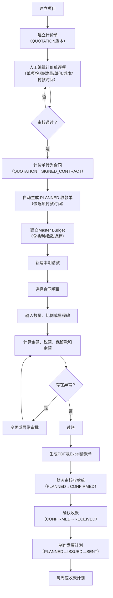

# 业务规则 (Business Rules)

## 业务流程总览



---

## 1. 合同版本管理 (Contract Version Management)

### 核心原则：版本不可覆盖

- 每个合同可有多个版本（`contract_versions`），每个版本有独立的 `version_no`。
- `contracts.active_version_id` 指向当前生效版本，**仅通过"批准合同版本"工作流更新**，不可直接编辑。
- 历史版本始终可查，状态流转：`DRAFT → UNDER_REVIEW → APPROVED → SUPERSEDED`（或 `REJECTED`）。

### 版本类型 (`version_type`)

| 类型 | 说明 |
|---|---|
| `QUOTATION` | 报价版 |
| `SIGNED_CONTRACT` | 签约合同 |
| `PROVISIONAL` | 暂定版 |
| `INTERNAL_ADJUSTMENT` | 内部调整（需人工确认是否升级为变更） |
| `APPROVED_VARIATION` | 已批准变更 |

### 关键约束

- **版本差异不自动升级为变更**：当两个版本金额不同时，差异（如 39,333）显式展示，但**不自动**创建 `APPROVED_VARIATION`。必须由人工提供业务理由并审批后才能升级。
- `UNIQUE (contract_id, version_no)` — 同一合同内版本号唯一。
- 请款行冻结 `contract_version_id`——后续合同修订**不会**重算历史行。描述、单位、单价快照同样冻结。

---

## 2. 付款规则 (Payment Rules)

### 核心原则：可配置，不硬编码

付款规则存储在 `payment_rules` 表中，**绝不硬编码** 80/10/10 或 20% 等比例。所有保留款、扣款、里程碑释放均通过规则配置驱动。

### 规则类型 (`rule_type`)

| 类型 | 说明 |
|---|---|
| `PROGRESS_PAYMENT` | 进度款 |
| `RETENTION_HOLD` | 保留款扣留 |
| `RETENTION_RELEASE` | 保留款释放 |
| `MILESTONE_PAYMENT` | 里程碑付款 |
| `ADVANCE_PAYMENT` | 预付款 |
| `DEDUCTION` | 扣款 |
| `TAX` | 税额 |
| `ROUNDING` | 舍入 |
| `PENALTY` | 罚款 |

### 规则字段

- `calculation_base` — 计算基数（本期金额 / 累计金额 / 合同总额）
- `release_sequence` — 释放顺序（如里程碑释放顺序）
- 生效窗口 — 开始/结束期间

### 示例：25-032 项目

- 10% 保留款扣留（基数 = 本期完成金额）
- 里程碑触发释放（按合同约定里程碑节点）

---

## 3. 计算方法 (Calculation Methods)

合同明细项的 `calculation_method` 决定金额计算方式：

| 方法 | 公式 | 说明 |
|---|---|---|
| `QUANTITY` | `批准数量 × 单价快照` | 最常用，用户编辑数量不编辑金额 |
| `LUMP_SUM` | 比例 × 行金额 或 直接金额 | 直接金额需附原因；超阈值需审批 |
| `MILESTONE` | 关联里程碑 APPROVED 时释放全额或配置比例 | 未批准则金额为 0 |
| `PERCENTAGE` | 百分比 × 基数 | 按完成比例计算 |
| `ALLOWANCE` | 暂列金 | 按约定释放 |
| `ADJUSTMENT` | 调整项 | 手动调整，需审批 |
| `HEADING` | 标题行 | 不可请款，仅分组 |

### 可用量计算

```
可用量 = 合同数量 + Σ(批准变更增量) − Σ(批准扣减量)
剩余量 = 可用量 − 累计已批准数量
```

- 当 `current_claimed_qty + prev > available` 时，引擎抛出 `OverclaimError`，**绝不静默截断**。
- 保留款、税额基于 `payment_rules` 配置计算，非硬编码。

---

## 4. 保留款台账 (Retention Ledger)

### 核心原则：台账制，无可变余额列

保留款通过 `retention_entries` 台账分录管理，余额 = `SUM(entries)`，**不存在可变的余额列**。

### 分录类型

| 类型 | 方向 | 说明 |
|---|---|---|
| `HOLD` | 扣留 | 本期扣留的保留款 |
| `RELEASE` | 释放 | 释放保留款至请款 |
| `ADJUSTMENT` | 调整 | 余额调整（需审批） |
| `REVERSAL` | 冲销 | 冲销历史分录 |

### 释放规则

- 释放通过台账分录（RELEASE/REVERSAL）实现。
- `retention_released_amount` = `Σ(本期释放分录)`，从台账聚合计算，不读取可变余额列。
- 里程碑释放按 `payment_rules.release_sequence` 顺序执行。

### 25-032 示例

| 期 | 本期完成 | 保留款扣留 | 释放 | 含税发票 |
|---|---|---|---|---|
| 2 | 401,792 | 74,600 | 0 | 343,552 |
| 3 (Phase 2) | 0 | 0 | 980,496 | 1,029,521 |

---

## 5. 过账幂等 (Idempotent Posting)

### 核心原则：同一操作不重复写入

过账操作 `post(payment_application_id, action_id)`：

- 若 `(app_id, action_id)` 已在台账中，**返回上次结果，不重复写入**。
- 幂等键 `action_id` 由调用方提供（UUID），确保网络重试不会导致重复过账。

### 过账冻结

- 过账后状态变为 `POSTED`，**所有行不可编辑**（API 返回 409）。
- 更正需创建冲销分录 + 新修订（`supersedes_application_id` 指向原请款），**原请款永不修改**。
- 过账时冻结 `contract_version_id`、单价快照、描述快照。

### 状态流转

```
DRAFT → VALIDATING → NEEDS_CHANGES → SUBMITTED → PROJECT_APPROVED → FINANCE_APPROVED → POSTED
                                                                                    ↓
                                                                              GENERATED → SENT
```

拒绝路径：任何审批步骤 `REJECTED` → 资源冻结，需新建修订。

---

## 6. 验证门禁 (Validation Gate)

验证在**提交 AND 过账**时运行，任一 `severity=ERROR` 的验证问题将阻止过账：

| 检查项 | 失败异常 |
|---|---|
| 合同版本状态 = APPROVED | — |
| 明细 `is_billable` 且非 `is_heading` | — |
| `current_claimed_qty >= 0` | — |
| 累计数量 ≤ 可用量 | `OverclaimException` |
| 单价快照 = 合同版本单价 | `StalePriceException` |
| 上期累计 = 上次过账累计 | `PriorMismatchException` |
| 保留款规则可解析 | `MissingRetentionException` |
| 税额重算 = 存储税额（容差 0.01） | — |
| 所有扣款关联 APPROVED 审批步骤 | — |
| 里程碑事件满足里程碑行 | — |
| 必需文档已上传 | — |
| 无未批准变更请款 | — |
| 无重复 (contract_id, application_no, period_no) | — |

每个失败返回结构化 `ValidationIssue{code, field, message, severity}`。

---

## 7. 请款单生成 (Document Generation)

- **PDF**：Playwright Chromium 渲染 A4 可打印文档。
- **Excel**：openpyxl 生成 .xlsx。
- **数据一致性**：PDF 合计必须 = 数据库合计（测试 #19 验证）。
- **模板**：客户级模板，含版本 + 生效日期。
- **不可覆盖**：已发送版本不可覆盖；重新生成 = 新版本。
- **无自动签章**：盖章/电子签/发送为独立受控功能（默认关闭）。
- **数字格式**：数字列右对齐 + 千分位分隔；换页重复表头；避免不合理行拆分。

---

## 8. 审批工作流 (Approval Workflow)

- `approval_workflows` 定义模板（如"请款 > 1,000,000 → PM + 造价 + 财务"）。
- `approval_steps` 为有序角色门控步骤列表。
- `approvals` 记录每位审批人决策。
- 资源**仅在所有必需步骤 APPROVED 后**视为已批准。
- **幂等**：重复审批返回已有记录。
- **拒绝冻结**：REJECTED 后资源冻结，需新建修订（不可解冻）。
- 工作流可按金额、项目、合同或异常类型配置。

### 我的请款清单与新建预填

- 「我的请款」仅列出当前用户建立的请款单，并按建立时间由新到旧显示，便于追踪个人提交与审批状态。
- 新建请款时，前端会根据所选合同已有请款的最大期数预填下一期，并以 `合同编号-P期数` 预填请款编号；用户仍可在提交前修改可编辑字段。
- 请款明细、提交、审批、过账和详情读取仍须通过后端项目成员检查；清单与导航展示不取代服务端权限控制。

---

## 9. 数据隔离 (Data Isolation)

- **组织级**：所有业务表含 `organization_id`，服务层强制过滤。
- **项目级**：用户仅能访问所属 `project_members` 项目；拥有管理员类别角色的用户例外。新建项目时，创建者自动加入该项目并取得 `PROJECT_MANAGER` 项目成员身份。
- **URL 不可绕过**：权限检查在服务层执行，非前端路由。
- 25-032 数据永不进入 24-023（测试 #18 验证）。

---

## 10. 群组与用户授权 (Group-based Access Control)

### 核心原则：群组授予角色，角色决定权限

- 群组、群组角色与用户群组成员关系分别存放于 `groups`、`group_roles`、`user_groups`；同一组织内群组名称唯一。
- 只有 `ACTIVE` 群组的角色会生效。用户拥有一个或多个有效群组时，系统汇总这些群组的角色；仅在没有有效群组角色时，才回退读取历史 `user_roles`。
- 角色归入五类：`ADMIN`（系统/合同管理员）、`FINANCE`（财务与造价）、`LEADER`（项目负责人/项目人员）、`AUDITOR`、`VIEWER`。类别用于导航展示和类别级授权，细粒度业务授权仍由角色判断。
- 管理员类别可管理用户与群组，并可绕过项目成员限制；其余用户仍须符合具体 API 的角色及项目成员要求。

### 默认群组与保护规则

- 迁移会为每个有效组织建立管理员、财务、项目组长、项目人员、审计及只读默认群组，并将既有直接角色映射至对应群组成员关系。
- 默认群组不可删除或停用。自助移除管理员成员时，系统不得让操作者离开最后一个有效管理员群组。
- 用户、群组、群组角色与群组成员的管理 API 均要求管理员授权；前端隐藏菜单仅为操作便利，不能取代后端授权检查。

---

## 11. 变更单管理 (Variation Management) — Phase 2

### 核心原则：未批准变更不可请款

- 变更单（`variations`）记录合同的数量/金额调整，状态：`DRAFT → UNDER_REVIEW → APPROVED/REJECTED`。
- **仅 APPROVED 变更**的 `quantity_delta` 纳入可用量计算。
- `get_approved_variation_qty(contract_item_id)` 汇总已批准变更增量，供 `check_quantity_limit` 使用。
- 由测试 #4（未批准变更不可请款）验证。

---

## 12. 扣款税务处理 (Deduction Tax) — Phase 2

### 核心原则：按税务处理类型计算

| 税务处理 | 税额计算 | 说明 |
|---|---|---|
| `TAXABLE` | `amount × tax_rate` | 扣款金额含税 |
| `NON_TAXABLE` | 0 | 扣款不含税 |
| `TAX_ADJUSTMENT` | `amount × tax_rate` | 税务调整 |

- 扣款需 APPROVED 后才纳入请款计算。
- `get_total_deduction_amount(app_id)` 汇总已批准扣款。
- 由测试 #9（扣款税务处理）验证。

---

## 13. 发票与收款差异 (Invoice/Collection Variance) — Phase 2

### 核心原则：差异显式记录，不自动核销

- 发票（`invoices`）关联已过账请款（`invoice_application_links`）。
- 收款（`collections`）分配到发票（`collection_allocations`）。
- `get_invoice_outstanding(invoice_id)` = 含税金额 - 已分配收款。
- **差异不自动核销**：90/30 差异独立记录，需人工创建 `financial_adjustments` 核销。
- 邮件建议发票（source=EMAIL_SUGGESTED）标记为 DRAFT，不自动纳入已开票金额。
- 由测试 #12（发票/收款差异）验证。

### 25-032 示例

| 发票 | 含税金额 | 收款 | 差异 |
|---|---|---|---|
| INV-25-032-001 | 7,892,613 | 7,892,523 | 90 |
| INV-25-032-002 | 343,552 | 343,522 | 30 |
| INV-25-032-003 | 1,900,024 | — | 邮件建议（DRAFT） |

---

## 14. 标准项目匹配 (Standard Item Matching) — Phase 2

### 匹配管道

```
标准化 → 精确别名 → 规则匹配 → 全文检索 → 向量检索（可选）→ LLM 排序（可选）
```

### 自动应用条件

仅当 `match_method=EXACT_ALIAS` **且** `unit_compatibility=SAME` 时可自动应用，其余均需人工审核。

### LLM 限制

- LLM 仅从系统提供的候选中排序并解释。
- **不能**创建标准项目 ID、计算成本、决定转换、自动审批或写入数据库。
- LLM 失败 → 人工审核回退。
- 由测试 #17（LLM 输出 schema）验证。

---

## 15. 报表与数据库视图 (Reports & DB Views) — Phase 3

### 8 个 SQL 视图（迁移 015）

| 视图 | 说明 |
|---|---|
| `v_contract_item_balances` | 合同项目可用量 vs 已请款量（含变更增量） |
| `v_project_commercial_summary` | 项目商业汇总：合同金额、已开票、保留款 |
| `v_retention_balances` | 保留款余额：HOLD - RELEASE - REVERSAL |
| `v_uninvoiced_approved_amounts` | 已过账未开票金额 |
| `v_invoice_outstanding` | 发票未清金额 |
| `v_collection_variances` | 发票 vs 收款差异 |
| `v_cost_margin_analysis` | 成本毛利分析（需已批准映射 + 标准成本） |
| `v_pending_exceptions` | 待处理异常：未批准变更/映射/扣款 + 未核销差异 |

### 报表 API

9 个端点位于 `/api/reports/*`，每个端点返回视图的完整行集（支持按 `contract_id` 或 `project_id` 过滤）。审计日志端点直接查询 `audit_logs` 表（最近 100 条）。

### 前端

- `/reports` — 报表中心，侧边栏选择报表类型，数据表展示结果。
- `/audit` — 审计日志浏览器。

---

## 16. 备份一致性检查 (Backup Consistency) — Phase 3

### 核心原则：DB 完整性可验证

`scripts/backup_check.py` 执行 6 项完整性检查：

| 检查 | 说明 |
|---|---|
| 已过账请款有保留款分录 | POSTED 且 gross>0 的请款必须有 HOLD 分录 |
| 发票金额约束 | `amount_ex_tax + tax_amount = amount_inc_tax`（容差 0.01） |
| 合同版本金额约束 | 同上 |
| 无孤立请款明细行 | 所有 application_lines 必须有有效 payment_application_id |
| 保留款余额非负 | 每个合同的 retention balance 不应为负 |
| 无重复发票号 | 同一合同内 invoice_no 唯一 |

- 任一检查失败返回非零退出码。
- 由测试 #20（备份一致性）验证。

### 备份恢复

- **数据库**：`pg_dump` + `psql` 恢复（见 README §11）。
- **文件存储**：Docker volume `archive` 通过 `tar` 备份/恢复。
- **一致性**：DB 和文件存储必须在同一备份周期处理。

---

## 17. 文档模板管理 (Document Template Management) — Phase 3

### 数据模型

| 表 | 说明 |
|---|---|
| `document_templates` | 客户级模板（BILLING/INVOICE），含生效日期、版本、项目关联 |
| `generated_documents` | 生成的 PDF/Excel 文档，关联请款单和模板，区分草稿/最终版 |

### 规则

- 每个模板有 `effective_from` / `effective_to` 生效窗口。
- `GeneratedDocument.is_final` 区分草稿与最终版。
- 重新生成 = 新版本（`version_no` 递增），**不覆盖已发送版本**。
- 模板按项目或组织级别管理。
