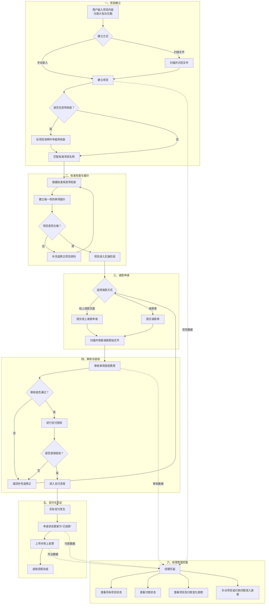

### 我的主要目的是希望建立这样子的一个系统。

第一，用户把项目的内容，包括付款计划以及日期输入到系统之中，或者通过扫描文件直接建立项目。
第二，项目进来之后，首先看相对应的标准项目名称，逐项检查，并且建立每一项的单项报价，这个需要预先搭建标准库。
第三，项目合格实施之后，可以请款，通过线上的请款页面或者请款单，需要能够扫描原始件并且保留，进入审核阶段。
第四项目进入实施中之后，进入审核阶段的单项提款费用需要审核并且授权之后才能够进入支付。
第五个，进入支付流程之后，当支部发生，可以将原来的申请改为已请款的状态，并且可以附上发票。
第六，如果项目中有特有款，这个部分也在项目的说明中进行申报。
第七，项目能够提供一个完整的经理页面，能够清楚地看到所有项目的状况，付款的状况，包括其中变化的趋势，还有，如果对于项目或付款有疑问，可以深入地调查。

### 图形如下：

