# Entity Relationship Diagram (ERD)

Engineering Contract & Billing System — full schema. Tables are grouped by domain.
See `DATA_DICTIONARY.md` for full column-level reference.

## Domains

| Domain | Description |
|---|---|
| IDENTITY | Multi-tenant organizations, users, roles |
| PROJECT | Companies, projects, members, parties |
| CONTRACT | Contracts, versions, line items, payment rules |
| STANDARD | Standard item master, aliases, cost versions |
| BILLING | Payment applications, lines, milestones, retention, variations |
| FINANCE | Deductions, invoices, collections, allocations, adjustments |
| FILES | Storage roots, documents, links, templates, generated docs |
| AUDIT | Approval workflows/steps, approvals, audit logs, mappings, reviews |

## Full ERD

```mermaid
erDiagram
    %% ===== IDENTITY =====
    organizations ||--o{ users : "owns"
    organizations ||--o{ companies : "owns"
    organizations ||--o{ projects : "owns"
    organizations ||--o{ storage_roots : "owns"
    organizations ||--o{ standard_items : "owns"
    organizations ||--o{ approval_workflows : "owns"
    organizations ||--o{ document_templates : "owns"
    organizations ||--o{ generated_documents : "owns"
    organizations ||--o{ audit_logs : "scopes"

    users ||--o{ user_roles : "has"
    roles ||--o{ user_roles : "assigned"
    users ||--o{ project_members : "member"
    users ||--o{ projects : "manages"

    %% ===== PROJECT =====
    projects ||--o{ contracts : "contains"
    projects ||--o{ project_members : "has"
    projects ||--o{ project_parties : "has"
    companies ||--o{ project_parties : "participates"
    companies ||--o{ contracts : "customer"
    companies ||--o{ contracts : "contractor"

    %% ===== CONTRACT =====
    contracts ||--o{ contract_versions : "versions"
    contracts ||--o{ payment_applications : "billed"
    contracts ||--o{ variations : "varied"
    contracts ||--o{ deductions : "deducted"
    contracts ||--o{ invoices : "invoiced"
    contracts ||--o{ collections : "collected"
    contracts ||--o{ retention_entries : "retention"
    contract_versions ||--o{ contract_items : "lines"
    contract_versions ||--o{ payment_rules : "rules"
    contract_versions ||--o{ payment_application_lines : "snapshot"
    contract_items ||--o{ contract_items : "parent"
    contract_items ||--o{ payment_rules : "applies"
    contract_items ||--o{ payment_application_lines : "claimed"
    contract_items ||--o{ variations : "adjusted"
    contract_items ||--o{ milestone_events : "milestone"
    contract_items ||--o{ item_mappings : "mapped"
    contract_items ||--o{ matching_reviews : "reviewed"

    %% ===== STANDARD =====
    standard_items ||--o{ standard_item_aliases : "aliases"
    standard_items ||--o{ standard_cost_versions : "costs"
    standard_items ||--o{ item_mappings : "mapped"
    standard_items ||--o{ mapping_components : "component"

    %% ===== BILLING =====
    payment_applications ||--o{ payment_application_lines : "lines"
    payment_applications ||--o{ retention_entries : "holds"
    payment_applications ||--o{ deductions : "applied"
    payment_applications ||--o{ generated_documents : "produces"
    payment_applications ||--o{ invoice_application_links : "linked"
    payment_applications ||--o{ payment_applications : "supersedes"
    projects ||--o{ payment_applications : "has"
    projects ||--o{ retention_entries : "has"
    projects ||--o{ milestone_events : "has"

    %% ===== VARIATIONS =====
    variations ||--o{ variation_lines : "lines"
    contract_items ||--o{ variation_lines : "affects"

    %% ===== FINANCE =====
    invoices ||--o{ invoice_application_links : "links"
    invoices ||--o{ collection_allocations : "allocated"
    invoices ||--o{ financial_adjustments : "adjusted"
    collections ||--o{ collection_allocations : "allocates"
    collections ||--o{ financial_adjustments : "adjusted"
    projects ||--o{ invoices : "has"
    projects ||--o{ collections : "has"
    projects ||--o{ deductions : "has"
    projects ||--o{ financial_adjustments : "has"

    %% ===== MAPPINGS =====
    item_mappings ||--o{ mapping_components : "components"
    projects ||--o{ item_mappings : "has"
    projects ||--o{ matching_reviews : "has"
    item_mappings ||--o{ matching_reviews : "reviewed"

    %% ===== APPROVALS / AUDIT =====
    approval_workflows ||--o{ approval_steps : "steps"
    approval_workflows ||--o{ approvals : "records"
    retention_entries ||--o{ retention_entries : "reversal_of"

    %% ===== FILES =====
    storage_roots ||--o{ documents : "stores"
    documents ||--o{ document_links : "links"
    projects ||--o{ documents : "has"
    projects ||--o{ document_templates : "has"
    document_templates ||--o{ generated_documents : "generates"

    %% ===== ENTITY DEFINITIONS =====
    organizations {
        UUID id PK
        STRING code UK
        STRING name
        STRING default_currency
        STRING status
    }
    users {
        UUID id PK
        UUID organization_id FK
        STRING email
        STRING display_name
        STRING status
    }
    roles {
        UUID id PK
        ENUM name UK
        STRING description
    }
    user_roles {
        UUID id PK
        UUID user_id FK
        UUID role_id FK
        UUID organization_id FK
    }
    companies {
        UUID id PK
        UUID organization_id FK
        STRING code
        STRING name
        STRING company_type
    }
    projects {
        UUID id PK
        UUID organization_id FK
        UUID project_manager_id FK
        STRING internal_project_code
        STRING project_name
        STRING status
    }
    project_members {
        UUID id PK
        UUID project_id FK
        UUID user_id FK
        ENUM project_role
    }
    project_parties {
        UUID id PK
        UUID project_id FK
        UUID company_id FK
        STRING role_in_project
    }
    contracts {
        UUID id PK
        UUID project_id FK
        UUID customer_company_id FK
        UUID contractor_company_id FK
        UUID active_version_id FK
        STRING external_contract_no
        STRING status
    }
    contract_versions {
        UUID id PK
        UUID contract_id FK
        INTEGER version_no
        ENUM status
        NUMERIC amount_inc_tax
    }
    contract_items {
        UUID id PK
        UUID contract_version_id FK
        UUID parent_item_id FK
        STRING line_no
        NUMERIC contract_quantity
        NUMERIC unit_price
    }
    payment_rules {
        UUID id PK
        UUID contract_version_id FK
        UUID contract_item_id FK
        ENUM rule_type
        NUMERIC rate
    }
    payment_applications {
        UUID id PK
        UUID project_id FK
        UUID contract_id FK
        UUID contract_version_id FK
        UUID supersedes_application_id FK
        STRING application_no
        ENUM status
    }
    payment_application_lines {
        UUID id PK
        UUID payment_application_id FK
        UUID contract_item_id FK
        UUID contract_version_id FK
        NUMERIC current_approved_quantity
        NUMERIC net_amount
    }
    retention_entries {
        UUID id PK
        UUID project_id FK
        UUID contract_id FK
        UUID payment_application_id FK
        UUID contract_item_id FK
        UUID reversal_of_id FK
        ENUM entry_type
        NUMERIC amount
    }
    milestone_events {
        UUID id PK
        UUID project_id FK
        UUID contract_item_id FK
        STRING milestone_name
        STRING status
    }
    variations {
        UUID id PK
        UUID project_id FK
        UUID contract_id FK
        UUID contract_item_id FK
        STRING variation_no
        ENUM status
    }
    variation_lines {
        UUID id PK
        UUID variation_id FK
        UUID contract_item_id FK
        NUMERIC quantity_delta
        NUMERIC amount_delta
    }
    deductions {
        UUID id PK
        UUID project_id FK
        UUID contract_id FK
        UUID payment_application_id FK
        STRING deduction_no
        ENUM status
    }
    invoices {
        UUID id PK
        UUID project_id FK
        UUID contract_id FK
        STRING invoice_no
        ENUM invoice_type
        ENUM status
    }
    invoice_application_links {
        UUID id PK
        UUID invoice_id FK
        UUID payment_application_id FK
        NUMERIC linked_amount
    }
    collections {
        UUID id PK
        UUID project_id FK
        UUID contract_id FK
        STRING receipt_no
        NUMERIC amount_received
        ENUM status
    }
    collection_allocations {
        UUID id PK
        UUID collection_id FK
        UUID invoice_id FK
        NUMERIC allocated_amount
    }
    financial_adjustments {
        UUID id PK
        UUID project_id FK
        UUID invoice_id FK
        UUID collection_id FK
        STRING adjustment_no
        STRING status
    }
    standard_items {
        UUID id PK
        UUID organization_id FK
        STRING code
        STRING name
        BOOLEAN is_active
    }
    standard_item_aliases {
        UUID id PK
        UUID standard_item_id FK
        STRING alias_text
        BOOLEAN is_approved
    }
    standard_cost_versions {
        UUID id PK
        UUID standard_item_id FK
        INTEGER version_no
        NUMERIC unit_cost
        STRING status
    }
    item_mappings {
        UUID id PK
        UUID project_id FK
        UUID contract_item_id FK
        UUID standard_item_id FK
        ENUM status
        NUMERIC confidence
    }
    mapping_components {
        UUID id PK
        UUID item_mapping_id FK
        UUID contract_item_id FK
        UUID standard_item_id FK
        NUMERIC component_ratio
    }
    matching_reviews {
        UUID id PK
        UUID project_id FK
        UUID item_mapping_id FK
        UUID contract_item_id FK
        STRING review_type
        STRING status
    }
    approval_workflows {
        UUID id PK
        UUID organization_id FK
        STRING name
        STRING resource_type
        BOOLEAN is_active
    }
    approval_steps {
        UUID id PK
        UUID workflow_id FK
        INTEGER step_order
        STRING role_required
    }
    approvals {
        UUID id PK
        UUID workflow_id FK
        STRING resource_type
        UUID resource_id
        STRING decision
        UUID decided_by
    }
    audit_logs {
        UUID id PK
        UUID organization_id FK
        UUID user_id FK
        STRING action
        STRING resource_type
        STRING resource_id
    }
    storage_roots {
        UUID id PK
        UUID organization_id FK
        STRING code
        STRING base_path
        STRING storage_type
    }
    documents {
        UUID id PK
        UUID organization_id FK
        UUID project_id FK
        UUID storage_root_id FK
        STRING document_type
        STRING sha256
    }
    document_links {
        UUID id PK
        UUID document_id FK
        STRING link_type
        UUID linked_id
    }
    document_templates {
        UUID id PK
        UUID organization_id FK
        UUID project_id FK
        STRING name
        STRING template_type
        BOOLEAN is_active
    }
    generated_documents {
        UUID id PK
        UUID organization_id FK
        UUID payment_application_id FK
        UUID document_template_id FK
        STRING doc_type
        INTEGER version_no
    }
```

## Table Summary (39 tables)

| # | Table | Domain | Description |
|---|---|---|---|
| 1 | `organizations` | IDENTITY | Tenant root |
| 2 | `users` | IDENTITY | Application users |
| 3 | `roles` | IDENTITY | Role catalog |
| 4 | `user_roles` | IDENTITY | User-role membership |
| 5 | `companies` | PROJECT | External parties (owner/contractor/supplier) |
| 6 | `projects` | PROJECT | Projects |
| 7 | `project_members` | PROJECT | Project team membership |
| 8 | `project_parties` | PROJECT | Company participation in a project |
| 9 | `contracts` | CONTRACT | Contract headers |
| 10 | `contract_versions` | CONTRACT | Versioned contract values |
| 11 | `contract_items` | CONTRACT | Contract line items |
| 12 | `payment_rules` | CONTRACT | Retention/milestone/tax rules |
| 13 | `standard_items` | STANDARD | Standard item master |
| 14 | `standard_item_aliases` | STANDARD | Alias text for matching |
| 15 | `standard_cost_versions` | STANDARD | Versioned standard costs |
| 16 | `payment_applications` | BILLING | Periodic payment applications |
| 17 | `payment_application_lines` | BILLING | Per-item claim lines |
| 18 | `milestone_events` | BILLING | Milestone tracking |
| 19 | `retention_entries` | BILLING | Retention hold/release ledger |
| 20 | `variations` | BILLING | Contract variations |
| 21 | `variation_lines` | BILLING | Per-item variation deltas |
| 22 | `deductions` | FINANCE | Offsetting deductions/penalties |
| 23 | `invoices` | FINANCE | Invoices / debit / credit notes |
| 24 | `invoice_application_links` | FINANCE | Invoice-to-application links |
| 25 | `collections` | FINANCE | Received payments |
| 26 | `collection_allocations` | FINANCE | Payment allocation to invoices |
| 27 | `financial_adjustments` | FINANCE | Post-collection adjustments |
| 28 | `storage_roots` | FILES | Storage backends |
| 29 | `documents` | FILES | Stored documents |
| 30 | `document_links` | FILES | Polymorphic document links |
| 31 | `document_templates` | FILES | Document/billing templates |
| 32 | `generated_documents` | FILES | Generated PDF/Excel outputs |
| 33 | `approval_workflows` | AUDIT | Workflow definitions |
| 34 | `approval_steps` | AUDIT | Ordered approval steps |
| 35 | `approvals` | AUDIT | Approval decision records |
| 36 | `audit_logs` | AUDIT | Immutable audit trail |
| 37 | `item_mappings` | AUDIT | Contract↔standard item mappings |
| 38 | `mapping_components` | AUDIT | Mapping component splits |
| 39 | `matching_reviews` | AUDIT | Mapping review queue |

## DB Views (reporting — migration 015)

| View | Purpose |
|---|---|
| `v_contract_item_balances` | Variation-adjusted available vs. approved quantities |
| `v_project_commercial_summary` | Contract value, invoiced, gross, retention per project |
| `v_retention_balances` | Retention held/released/balance per contract |
| `v_uninvoiced_approved_amounts` | Posted applications not yet linked to invoices |
| `v_invoice_outstanding` | Invoice outstanding after allocations |
| `v_collection_variances` | Invoice expected vs. received variances |
| `v_cost_margin_analysis` | Contract value vs. standard cost margin |
| `v_pending_exceptions` | Pending variations/mappings/deductions/variances |
