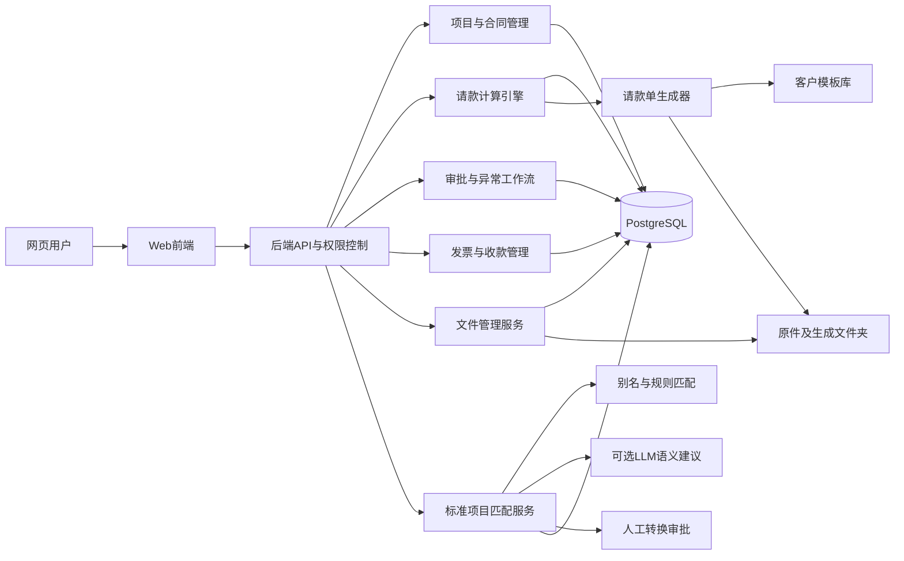
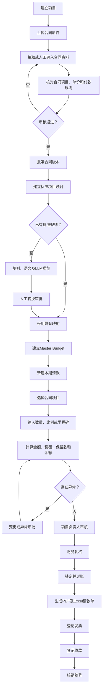

# Engineering Contract & Billing System — Design Spec

**Date:** 2026-07-22
**Status:** Approved (pending user review)
**Scope:** Full 3-phase implementation of an enterprise internal system for engineering contracts, standard costs, periodic billing, document archiving, approvals, invoices, and collections.

---

## 1. Purpose

A runnable, auditable, extensible enterprise internal system for engineering contracts and periodic billing ("工程合同及请款管理系统"). Primary mode is web-based direct billing entry. A secondary historical-import mode exists for backfilling legacy contracts/applications via OCR, always routed through manual review (never auto-posted).

Users: finance staff, project managers, construction staff, cost staff, reviewers, system admins. Default UI language is Simplified Chinese; code, DB fields, and API use English. LLM is optional — all core flows work without it.

## 2. Non-negotiable principles

1. Understand business rules before designing DB/UI.
2. All money calculations deterministic, traceable, recomputable.
3. Original contract text and files are never replaced by normalized data.
4. LLM only suggests semantic matches; it never computes, approves, or writes.
5. Approved history is never silently overwritten by later actions.
6. Every key number traces to a contract version, application, approval, and source file.
7. UI default Simplified Chinese; code/DB/API English naming.
8. Designed for finance/PM/cost/reviewer/admin — no technical jargon for end users.

## 3. Technology stack (decisions locked)

| Layer | Choice | Rationale |
|---|---|---|
| Frontend | Next.js (React + TS), static export served by nginx | Spec default; SPA-style internal admin |
| Backend | Python 3.12 + FastAPI | Spec |
| ORM | SQLAlchemy 2.x | Spec |
| Migrations | Alembic | Spec |
| DB | PostgreSQL 16 + pgvector | Spec; vector optional, full-text fallback |
| Broker | Redis 7 + Celery | Spec; day-1 for PDF/hash/OCR/LLM jobs |
| PDF | Playwright headless Chromium | HTML template → A4 print; repeating headers |
| Excel | openpyxl | Templated output |
| Containers | Docker Compose (5 services) | frontend, api, worker, postgres, redis |
| Auth | HttpOnly Secure cookies (15min access + 7d refresh) + CSRF | Spec security section |
| LLM | OpenAI-compatible client + StubClient (LLM_ENABLED=false) | Graceful degrade |

Python pinned to 3.12 in Docker (host may run 3.14 for editing). Playwright Chromium installed in the api/worker image (~300MB, cached layer). `pgvector/pgvector:pg16` image used for Postgres.

## 4. System architecture

```
Browser ── HTTPS ──> nginx (frontend static + /api proxy)
                         │
                         ├── Next.js static export
                         └── FastAPI (api) ──> PostgreSQL (data + pgvector)
                                  │          └── Redis (broker + cache)
                                  └── Celery worker ──> Playwright (PDF)
                                                       └── LLM client (OpenAI-compat or Stub)
                                  └── File service ──> /data/archive (volume)
```

Docker Compose services:

| Service | Image | Role |
|---|---|---|
| `frontend` | nginx + Next.js static export | SPA + reverse proxy `/api` → `api` |
| `api` | python:3.12-slim + FastAPI | REST, auth, RBAC, business logic |
| `worker` | same image as api + Celery | OCR, PDF, hash, LLM match |
| `postgres` | pgvector/pgvector:pg16 | data + optional vector |
| `redis` | redis:7 | Celery broker + result backend |

`api` and `worker` share one image (build once, two entrypoints).

### Mermaid architecture diagram (for ARCHITECTURE.md)



## 5. Repository layout (monorepo)

```
maggie/
  README.md ARCHITECTURE.md BUSINESS_RULES.md SECURITY.md
  BACKUP_RESTORE.md API.md
  docker-compose.yml .env.example
  backend/
    app/
      main.py config.py deps.py
      auth/            (rbac, cookies, password, audit)
      models/          (SQLAlchemy ORM, one file per domain)
      schemas/         (Pydantic v2)
      api/             (routers, one per resource group)
      services/
        calc_engine.py        (pure, unit-tested, no DB)
        file_service.py       (path-safe storage, hash, download)
        llm/                  (protocol + openai_impl + stub)
        matching/             (normalize, alias, rule, fulltext, vector)
        approval/             (workflow, steps, idempotent post)
        docgen/                (playwright PDF, openpyxl Excel, templates)
        ocr/                  (phase 3 adapter)
        reports/              (views + exporters)
      db/ session, base, pgvector, views
      tasks/            (Celery tasks)
      security/         (rate-limit, csrf, headers, audit)
    alembic/            (versions/, one migration per domain batch)
    tests/              (pytest, 20 required scenarios + unit)
  frontend/
    app/ (Next.js app router)  components/  lib/  hooks/
    tests/ (Vitest component, Playwright E2E)
  worker/  (thin: imports from backend.app.tasks)
  templates/   (billing PDF/Excel + customer templates)
  sample-data/ (25-032 + 24-023 known-facts seed JSON)
  scripts/     (init_admin.py, import_reference.py, backup_check.py)
  migrations/  (pointer to backend/alembic)
```

## 6. Phased delivery (all 3 phases in this cycle, commit after each)

### Phase 1 — core loop

**Modules:** Auth/RBAC/project-isolation, projects, companies, contracts, contract_versions, contract_items (tree), payment_rules, documents/storage, payment_applications + lines, calc_engine, approvals (project+finance), idempotent posting, PDF gen (Playwright), Excel (openpyxl).

**Tests green:** #1 合计, #2 版本不覆盖, #3 超量, #5 保留款, #7 释放, #8 税额/舍入, #10 过账幂等, #11 已过账不可编辑, #13 路径穿越, #14 哈希, #15 项目权限隔离, #16 LLM关闭核心流程, #19 PDF合计一致.

**Acceptance:** 25-032 period 1 + period 2 end-to-end → PDF; 24-023 contract + tree items saved.

### Phase 2 — billing + invoicing

**Modules:** standard_items + aliases + cost_versions, item_mappings + mapping_components + approval, variations + variation_lines, retention_entries ledger, deductions, invoices + links, collections + allocations, financial_adjustments, mapping_reviews, full matching pipeline (rule/fulltext/vector), LLM client (openai+stub).

**Tests:** #4 未批准变更不可请款, #6 项目级保留款例外, #9 扣款税务, #12 发票/收款差异, #17 LLM schema, #18 不同项目数据隔离.

**Acceptance:** 25-032 period 3 (释放保留款 980,496 + 税 49,025 + 含税 1,029,521), 71,000 扣款, 邮件 1,900,024 vs 第三期差异提示, 90/30 收款差异核销; Master Budget + 毛利.

### Phase 3 — completion

**Modules:** OCR adapter, historical import, customer template mgmt, reports (11), backup/restore tooling + consistency checker, E2E (Playwright), security hardening pass, all DB views (8), Mermaid ERD, data dictionary.

**Tests:** #20 备份一致性.

**Acceptance:** both projects full, all reports, audit log browsable, README complete.

## 7. Data model by domain

### Domain map (40+ tables)

```
IDENTITY (6)    organizations, users, roles, user_roles, project_members, companies
                + project_parties
PROJECT (2)     projects, storage_roots
CONTRACT (6)    contracts, contract_versions, contract_items, payment_rules,
                variations, variation_lines
STANDARD (5)    standard_items, standard_item_aliases, standard_cost_versions,
                item_mappings, mapping_components
BILLING (7)     payment_applications, payment_application_lines, milestone_events,
                retention_entries, deductions, approval_workflows, approval_steps
                + approvals
FINANCE (5)     invoices, invoice_application_links, collections,
                collection_allocations, financial_adjustments
FILES (5)       documents, document_links, document_templates,
                generated_documents, (storage_roots in PROJECT)
AUDIT (1)       audit_logs  (append-only, no update API)
```

All business tables include: UUID PK, `organization_id`, `created_by`, `created_at`, `updated_by`, `updated_at`, `deleted_at` (logical delete) or status, version/optimistic-lock column. Money `DECIMAL(18,2)`, quantities `DECIMAL(18,4)`, rates `DECIMAL(10,6)`, timestamps `TIMESTAMPTZ`.

### Key relationship invariants

- `contracts.active_version_id` → `contract_versions.id`; updated only via approve-contract-version workflow, never direct edit.
- `contract_items.parent_item_id` → self; tree with cycle guard via `sort_order` + depth check.
- `payment_application_lines.contract_version_id` **frozen** at creation; later contract revisions never recompute historical lines. Description/unit/price snapshots also frozen.
- `payment_applications.supersedes_application_id` → self; revisions never mutate the original.
- `retention_entries` ledger-only (HOLD/RELEASE/ADJUSTMENT/REVERSAL); balance = `SUM(entries)`, no mutable balance column.
- `item_mappings.status` ∈ {SUGGESTED, PENDING_REVIEW, APPROVED, REJECTED, NEEDS_CLARIFICATION}; only APPROVED feeds Master Budget; auto-apply only when `match_method=EXACT_ALIAS` AND `unit_compatibility=SAME`.
- `documents.is_immutable=true` for originals; `generated_documents.is_final` distinguishes draft vs final.

### DDL constraints

- `CHECK (amount_ex_tax + tax_amount = amount_inc_tax)` on contract_versions, invoices, payment_applications (tolerance 0.01).
- `CHECK (tax_mode IN ('EXCLUSIVE','INCLUSIVE','MIXED'))`.
- Enum `CHECK` constraints per table (SQLAlchemy Enum + DB CHECK).
- `UNIQUE (organization_id, internal_project_code)`; `UNIQUE (contract_id, version_no)`.
- `UNIQUE (payment_applications.contract_id, application_no, revision_no)`.
- `UNIQUE (documents.relative_path)` where not logical-deleted.
- App-level tenant filter on `organization_id` mandatory in service layer (RLS optional).
- Money/qty/rate types enforced; no float (Alembic linter test adjacent to #18).

### Field-level schema

Field-level definitions for every table are specified in the original prompt §4 and are normative for this spec. Key columns reproduced here for the calc-engine-relevant tables:

**contracts**: `tax_mode` (EXCLUSIVE/INCLUSIVE/MIXED), `tax_rate`, `original_amount_ex_tax`, `original_tax_amount`, `original_amount_inc_tax`, `active_version_id`, plus new `rounding_policy` (ROUND_HALF_UP/ROUND_DOWN/BANKERS) and `rounding_granularity`.

**contract_versions**: `version_type` (QUOTATION/SIGNED_CONTRACT/PROVISIONAL/INTERNAL_ADJUSTMENT/APPROVED_VARIATION), `status` (DRAFT/UNDER_REVIEW/APPROVED/SUPERSEDED/REJECTED).

**contract_items**: `calculation_method` (QUANTITY/LUMP_SUM/PERCENTAGE/MILESTONE/ALLOWANCE/ADJUSTMENT/HEADING), tree via `parent_item_id`, `is_heading`, `is_billable`, retention flags, extraction metadata.

**payment_rules**: `rule_type` (PROGRESS_PAYMENT/RETENTION_HOLD/RETENTION_RELEASE/MILESTONE_PAYMENT/ADVANCE_PAYMENT/DEDUCTION/TAX/ROUNDING/PENALTY), `calculation_base`, `release_sequence`, effective window. Never hardcoded 80/10/10 or 20%.

**payment_applications**: status enum (DRAFT/VALIDATING/NEEDS_CHANGES/SUBMITTED/PROJECT_APPROVED/FINANCE_APPROVED/POSTED/GENERATED/SENT/REJECTED/CANCELLED/SUPERSEDED), `supersedes_application_id`, `posted_at`.

**payment_application_lines**: snapshots (`description_snapshot`, `unit_snapshot`, `unit_price_snapshot`), `previous_approved_quantity`, `current_claimed_quantity`, `current_approved_quantity`, `cumulative_approved_quantity`, retention fields, tax fields, `validation_status`.

**deductions**: `type` (ADVANCE_PAYMENT_OFFSET/MATERIAL_DEDUCTION/EQUIPMENT_DEDUCTION/PENALTY/BACK_CHARGE/QUALITY_DEDUCTION/TAX_ADJUSTMENT/ROUNDING/OTHER), reason, amounts, tax treatment, related company, support docs, approval.

Full field lists for organizations, users, roles, user_roles, project_members, companies, project_parties, projects, standard_items, standard_item_aliases, standard_cost_versions, item_mappings, mapping_components, milestone_events, retention_entries, approval_workflows, approval_steps, approvals, invoices, invoice_application_links, collections, collection_allocations, financial_adjustments, storage_roots, documents, document_links, document_templates, generated_documents are as specified in prompt §4 and are normative.

## 8. Calculation engine (`backend/app/services/calc_engine.py`)

Pure Python, no DB imports, operates on dataclass inputs. Deterministic + unit-tested. Public functions:

```python
calc_line_current(item, prev_approved_qty, current_claimed_qty, price_snapshot,
                  rule_set, rounding_policy) -> LineResult
calc_application(lines, deductions, retention_entries_prev, tax_mode, tax_rate,
                rounding_policy) -> ApplicationTotals
validate_application(application, contract_version, prior_posted, rules) -> ValidationReport
```

### Invariants (tests check each)

1. QUANTITY line: `current_amount = current_approved_qty × price_snapshot`. User edits qty, never amount.
2. LUMP_SUM line: accept ratio OR direct amount; direct amount requires reason; approval flagged if `|amount| > line_amount × threshold`.
3. MILESTONE line: 0 unless linked milestone_event.status = APPROVED; once approved, claims full milestone amount (or configured %).
4. Available qty = `contract_qty + Σ(approved variations Δqty) − Σ(approved deductions that reduce qty)`. Remaining = available − cumulative approved. Engine raises `OverclaimError` if `current_claimed_qty + prev > available`; never silently caps.
5. Retention held this period = `base × rate` where base is rule-defined (current period or cumulative per `payment_rules.calculation_base`).
6. Retention released via ledger rows (RELEASE/REVERSAL); `retention_released_amount` = `Σ(release entries this period)`, never computed from a balance column.
7. Tax: `tax_mode` decides base; rounding policy per-contract (`ROUND_HALF_UP`/`ROUND_DOWN`/`BANKERS`, per-line vs per-total); `decimal.Decimal` explicit context. No float.
8. Net = `gross_completed − retention_held + retention_released − deductions + tax` (signs explicit). Output split into the 8 display buckets (§6.7): 本期完成金额, 本期保留款, 本期释放保留款, 本期扣款, 本期未税可开票金额, 税额, 含税发票金额, 实际收款金额.
9. Idempotency: `post(payment_application_id, action_id)` — if `(app_id, action_id)` in ledger, return prior result without inserting.
10. Posting freezes: after POSTED, edit API returns 409; corrections create reversal + new revision via `supersedes_application_id`.

## 9. Validation gate (§10) — runs on submit AND on post

```
contract_version.status == APPROVED
item.is_billable AND NOT item.is_heading
current_claimed_qty >= 0
cumulative_qty <= available_qty            (else OverclaimException)
price_snapshot == contract_version.unit_price   (else StalePriceException)
prev_cumulative == last posted cumulative (else PriorMismatchException)
retention rule resolves                    (else MissingRetentionException)
tax recomputes to stored tax_amount within 0.01
all deductions linked to APPROVED approval_step
milestone_events satisfy milestone lines
required documents present
no unapproved variation claims
no duplicate (contract_id, application_no, period_no)
```

Each failure → structured `ValidationIssue{code, field, message, severity}`; post blocked if any `severity=ERROR`.

## 10. Approval workflow

`approval_workflows` define a template (e.g., "billing > 1,000,000 → PM + Cost + Finance"). `approval_steps` is an ordered list of role-gated steps. `approvals` rows record each approver decision. A resource (contract_version, item_mapping, variation, application, deduction, retention_release) is **approved** only when all required steps are APPROVED.

- Idempotent: re-approve returns existing row.
- Rejection creates `REJECTED` row and freezes the resource; user must create a new revision (never unfreeze rejected).
- Workflows configurable by amount, project, contract, or exception type.

## 11. File service invariants (§5)

- On upload: canonicalize `relative_path` → `Path(base).resolve()`; assert `resolved.is_relative_to(storage_root.resolve())` else `PathTraversalException`.
- SHA-256 computed before write; duplicate hash flagged but does NOT merge business links.
- Originals: `is_immutable=true`, `is_original=true`; never overwritten; collisions stored as `<uuid>.<ext>`.
- Download streams by `document_id`; sets `Content-Disposition: attachment; filename="<original_name>"` (RFC 5987). Never returns server absolute path.
- Logical delete sets `deleted_at`; physical delete is a separate admin tool only.
- DB stores `storage_root_id + relative_path`; user never inputs absolute paths.
- Env `FILE_STORAGE_ROOT` configures root; size/ext/MIME limits; virus-scan interface reserved.

### Folder layout

```
{FILE_STORAGE_ROOT}/
  {organization_code}/
    {internal_project_code}/
      contracts/{external_contract_no}/v001/{original,extracted}/
      applications/{application_no}/{attachments,generated}/
      variations/ deductions/ milestones/ invoices/ collections/
      correspondence/ reports/
```

## 12. LLM matching (optional, §7)

**Not a hard dependency.** When `LLM_ENABLED=false`, billing/calc/approval/docgen still work; matching falls back to alias + rule + full-text (and vector if pgvector present).

**Pipeline:**
1. Normalize (full/half-width, spaces, 繁/简, brackets, units).
2. Exact approved-alias lookup.
3. Rule + full-text candidates.
4. Optional vector candidates (pgvector).
5. LLM only ranks/explains from system-provided candidates.
6. LLM output → human review.
7. Human approval writes alias + mapping to DB.

**LLM output JSON schema (validated):**
```json
{
  "source_item_id": "uuid",
  "candidate_matches": [
    {
      "standard_item_id": "uuid",
      "confidence": 0.0,
      "reasoning": "简短可审计的匹配原因",
      "unit_compatibility": "SAME|CONVERTIBLE|INCOMPATIBLE|UNKNOWN",
      "conversion_required": false,
      "scope_differences": [],
      "questions_for_reviewer": []
    }
  ],
  "suggested_mapping_type": "ONE_TO_ONE|ONE_TO_MANY|MANY_TO_ONE|NOT_COMPARABLE"
}
```

**Hard limits:** LLM never creates standard item IDs, computes cost, decides conversions, auto-approves, or writes to DB. Contract item text is untrusted input — cannot influence system prompt or tool calls. LLM failure → human review fallback. Only人工-approved exact-alias + same-unit may auto-apply.

**Mandatory human approval for:** first-seen mapping, unit mismatch, one-to-many/many-to-one, conversion needed, lump-sum, unclear scope, abnormal margin, LLM/vector match, new standard item.

## 13. UI screens (§8) — responsive desktop-first, default 简体中文

8.1 Login/permissions · 8.2 Management dashboard · 8.3 File inbox · 8.4 Project list+detail (tabbed) · 8.5 Contract extraction review (split view) · 8.6 Master Budget · 8.7 Standard item catalog · 8.8 Mapping approval (3-pane) · 8.9 Billing wizard (stepped) · 8.10 Approval & exception center · 8.11 Variation/retention/deduction ledgers · 8.12 Invoice & collection · 8.13 File archive · 8.14 Reports (11).

No business calc in frontend; all computed results come from API. No dead buttons (RESTRAIN §27) — stubbed phase-2/3 routes return a guarded "not implemented" response, not fake UI.

## 14. Document generation (§9)

Customer-level templates with version + effective date. Billing doc contains: company, owner, project name, contract no, date, period, total, line no, item, unit, contract qty, unit price, line amount, prev cumulative, current, current cumulative, work amount, retention, billed amount, tax, invoice amount, actual/expected amount, remarks, signature columns.

**Requirements:** printable A4 PDF; optional Excel; uses approved data; input params snapshotted; regenerate = new version; sent versions not overwritable; no auto-stamp/signature; stamp/e-sign/send are separate controlled functions (default off); right-aligned numeric columns with thousands separators; repeat header on page break; no unreasonable row splits; PDF totals == DB totals.

## 15. API surface (§11)

REST endpoints covering: `/auth`, `/users`, `/roles`, `/companies`, `/projects`, `/projects/{id}/members`, `/contracts`, `/contracts/{id}/versions`, `/contract-versions/{id}/items`, `/payment-rules`, `/standard-items`, `/standard-item-aliases`, `/item-mappings`, `/mapping-reviews`, `/variations`, `/payment-applications`, `/payment-applications/{id}/lines`, `/payment-applications/{id}/validate`, `/payment-applications/{id}/submit`, `/payment-applications/{id}/approve`, `/payment-applications/{id}/post`, `/payment-applications/{id}/generate`, `/retention-entries`, `/deductions`, `/invoices`, `/collections`, `/documents`, `/documents/{id}/preview`, `/documents/{id}/download`, `/approvals`, `/reports`.

Every endpoint: permission check, input validation, pagination, filtering, sorting, unified error structure, operation audit, concurrency/version-conflict handling.

## 16. Security & audit (§12)

RBAC + project-level access control (URL change cannot bypass). Password hashing. HttpOnly+Secure cookies (15min access, 7d refresh). CSRF protection. Login rate-limit. Upload rate-limit + size limit. File type validation. Path traversal prevention. SQL injection prevention (parameterized). XSS prevention (output encoding). Security response headers. Secrets via env vars only. Logs never include passwords/keys/full sensitive file content. All approvals/postings/voids/downloads/permission-changes written to append-only audit log. Audit log not editable via UI. Data export + backup plan provided.

## 17. Database views (8, via Alembic)

`v_contract_item_balances`, `v_project_commercial_summary`, `v_retention_balances`, `v_uninvoiced_approved_amounts`, `v_invoice_outstanding`, `v_collection_variances`, `v_cost_margin_analysis`, `v_pending_exceptions`. SQL-backed (not materialized initially; indexes added in phase 3 perf pass).

## 18. Test plan (20 required + unit + E2E)

| # | Test | Phase | Layer |
|---|---|---|---|
| 1 | Contract item sum | 1 | calc_engine unit |
| 2 | Version not overwritten | 1 | service + db |
| 3 | Over-qty blocked | 1 | calc_engine |
| 4 | Unapproved variation not claimable | 2 | service |
| 5 | Retention calc | 1 | calc_engine |
| 6 | Project-level retention exception | 2 | service |
| 7 | Retention release | 1 | service + ledger |
| 8 | Tax + rounding | 1 | calc_engine |
| 9 | Deduction tax handling | 2 | service |
| 10 | Posting idempotent | 1 | api |
| 11 | Posted not editable | 1 | api |
| 12 | Invoice/collection variance | 2 | service |
| 13 | Path traversal | 1 | file_service |
| 14 | File hash | 1 | file_service |
| 15 | Project permission isolation | 1 | api + rbac |
| 16 | Core flow with LLM off | 1 | integration |
| 17 | LLM output schema | 2 | matching (stub + fixture) |
| 18 | Cross-project data isolation | 2 | api |
| 19 | PDF totals match DB | 1 | docgen + api |
| 20 | Backup consistency | 3 | scripts |

Plus: unit tests for every calc_engine function, component tests (Vitest) for billing wizard + contract review split view, E2E (Playwright) for the full 17-step acceptance run.

**Definition of done:** tests actually executed and green (RESTRAIN §28) — no claims of pass without execution.

## 19. Sample data (sample-data/, loaded by scripts/seed.py)

Known-facts seed JSON. No reference files present; per spec §RESOURCE IV we build from known facts and leave a real-file import hook.

**25-032:**
- Project, contract CQ880A-11501.
- **Two contract_versions:** v1 = 10,476,190 ex-tax / 523,810 tax / 11,000,000 inc; v2 = 10,515,523 ex-tax (flagged UNCONFIRMED_ADJUSTMENT, not auto-variation) with diff 39,333 explicitly shown.
- 6 contract_items per version, line amounts: 2,494,000 / 661,200 / 5,980,000 / 455,000 / 850,000 / 35,990 (v1).
- payment_rules: 10% retention, milestone-based release.
- Period 1 + period 2 applications (period 2: 401,792 / 74,600 retention / 327,192 taxable / 16,360 tax / 343,552 inc).
- Phase 2 adds period 3 (0 / 980,496 release / 49,025 / 1,029,521), 2 deductions (60,000 + 11,000 = 71,000), email-suggested invoice 1,900,024 vs period-3 variance (flagged, not auto-reconciled), invoice 7,892,613 / collection 7,892,523 (diff 90) and invoice 343,552 / collection 343,522 (diff 30).

**24-023:**
- Project, contract FS11308001, 38,980,000 inc.
- 4+ parent groups with children, mixed units (处/式/孔/m/m³).
- Multi-period cumulative quantities + retention.

## 20. Reference files import

Real `.msg/.pdf/.csv` files are not present in the workspace. Per spec §RESOURCE IV: do not fabricate content or claim to have read them. Build from known-facts seed data; provide `scripts/import_reference.py` + README section explaining how to drop files into `[REFERENCE_FILES_DIR]` and run the importer (OCR + project identification → manual review queue).

## 21. Deliverables (§RESULT I)

```
README.md ARCHITECTURE.md BUSINESS_RULES.md SECURITY.md
BACKUP_RESTORE.md API.md
docker-compose.yml .env.example
frontend/ backend/ worker/ migrations/ tests/ templates/ sample-data/ scripts/
```

README covers: purpose, architecture, env requirements, Windows + Docker Desktop run, env vars, DB migration, initial admin creation, sample data import, file storage dir, test commands, backup/restore, LLM enable/disable, reference file import, known limits, production notes.

DB deliverables: full migrations, FK/unique/check constraints, indexes, sample data, 8 views, Mermaid ERD, data dictionary.

## 22. Acceptance scenarios

### 25-032 (§RESULT VIII)
1. Original version 10,476,190 saved.
2. Later basis 10,515,523 saved as different version or pending adjustment.
3. Original still viewable.
4. Diff 39,333 explicitly shown.
5. Period 2: 施工 401,792 / 保留 74,600 / 未税 327,192 / 税 16,360 / 含税 343,552.
6. Period 3: 施工 0 / 释放 980,496 / 税 49,025 / 含税 1,029,521.
7. Two deductions sum 71,000.
8. Email-suggested invoice 1,900,024.
9. System flags email vs period-3 mismatch; requires human explanation.
10. 90 and 30 diffs independently recorded + reconciled.
11. No diff auto-modifies contract amount.

### 24-023 (§RESULT IX)
1. Save inc-tax total 38,980,000.
2. 4+ parent groups.
3. Multiple children under parents.
4. Units 处/式/孔/m/m³.
5. Multi-period cumulative qty.
6. Retention.
7. 24-023 data never enters 25-032.

### Doc gen (§RESULT X)
A4 printable 25-032 sample billing: complete line items, prev/current/cumulative clear, retention/tax/invoice clear, numbers == DB, no original stamps/signatures, draft vs final distinguishable, file in storage + previewable + downloadable.

## 23. Restraints (40, from prompt RESTRAIN)

All 40 restraints are normative. Key affirmations: no project merge by filename; no original overwrites; no posted-application edits (reversal/revision only); no direct cumulative/balance edits; no float money; no hardcoded retention/tax/rounding; no LLM compute/approve/convert/write; no replacing original text with standard names; no auto-stamp/signature; no auto-email/invoice/payment; no real customer data to external LLM without explicit authorization; no secrets in logs; no static HTML/empty pages; no hardcoded examples over DB; no dead buttons; no test-pass claims without execution; no reference-file deletion; uncertain rules → human queue; high-risk ops need confirmation + permission + audit; modular services; API/DB naming consistent; no frontend business calc; untrusted input validated; contract-version diffs not auto-variation; 完成金额/批准请款/开票/收款 as distinct fields; generated files from approved/draft-flagged data; draft vs final clearly marked.

## 24. Operational flow (for BUSINESS_RULES.md)



## 25. Completion report (§RESULT XI)

At end: completed modules, incomplete modules + reasons, actual run commands, migration results, test results, sample accounts, sample projects, generated file locations, security/production notes, next-phase recommendations. "Done" requires core loop running + corresponding tests green — not "framework scaffolded".

## 26. Known risks accepted

- Playwright image size (~300MB Chromium) — cached layer.
- pgvector via `pgvector/pgvector:pg16` official image.
- E2E + PDF share Playwright browser infra.
- All-3-phases is large; commit after each phase milestone so a runnable system always exists.

## 27. Out of scope for this cycle

None — full spec, all 3 phases, all 20 tests, both projects' acceptance, PDF gen.
